# Lưu đồ giải thuật — Định hướng nguồn âm (DOA) & xoay camera servo

Hệ thống thu 8 mic (UCA, R = 40 mm), ước lượng hướng nguồn âm bằng **GCC-PHAT +
bảng TDOA**, lọc theo **clap gate**, rồi **xoay camera servo** (PB6/TIM4_CH1) về
hướng nguồn âm.

Thông số chính:

| Tham số | Giá trị |
|---|---|
| Tần số lấy mẫu `Fs` | 16 kHz |
| Bán kính mảng `R` | 0.040 m |
| Tốc độ âm `C` | 343 m/s |
| Trễ tối đa `(Fs/C)·2R` | 3.731778 mẫu |
| Số cặp mic đối xứng | 4 |
| Số hướng rời rạc `DOA_N_AZ` | 16 (bước 22.5°) |
| Cửa sổ bỏ phiếu | 16 block ≈ 1 s |
| Servo PWM | 50 Hz, PB6 = TIM4_CH1 |

---

## 1. Kiến trúc tổng quan (task & luồng dữ liệu)

```mermaid
flowchart TD
    subgraph HW[Phần cứng]
        MIC[8 mic I2S/SAI<br/>16 kHz, 24-bit] --> DMA[DMA1 vòng tròn<br/>PING / PONG]
    end

    DMA -->|ngắt nửa/đầy buffer| ISR[HAL_SAI_RxHalf/CpltCallback<br/>báo task qua TaskNotify]

    ISR -->|FLAG_FFT| FFT[FFT_Task &#40;StartTask02&#41;<br/>DSP + GCC-PHAT + clap level]
    FFT -->|result_queue<br/>tdoa_result_t| DOA[DOA_Task &#40;StartTask04&#41;<br/>matching + clap gate + servo]
    DOA -->|Servo_PointToAzimuth| SERVO[TIM4_CH1 PWM<br/>PB6 -> servo camera]
    DOA -->|printf| VCP[ST-Link VCP log<br/>plot_doa.py]

    FFT -.->|USB_RAW_STREAM| USB[USB_Task &#40;StartTask03&#41;<br/>CDC stream mic]
    MON[Monitor_Task &#40;StartTask05&#41;] -.-> VCP
```



---

## 2. Lưu đồ giải thuật chính (một chu kỳ block ≈ 62.5 ms)

```mermaid
flowchart TD
    START([DMA báo có nửa buffer mới]) --> WAIT[FFT_Task: xTaskNotifyWait FLAG_FFT]
    WAIT --> DEINT[Deinterleave_Pair<br/>tách 4 SAI block -> 8 kênh float<br/>mic_data&#91;0..7&#93;]
    DEINT --> FFTALL[FFT_ProcessAll<br/>cửa sổ + rFFT mỗi kênh]
    FFTALL --> GCC[GCC_ProcessPairs<br/>lag&#91;k&#93; = GCC_PHAT&#40;ch2k, ch2k+1&#41;<br/>k = 0..3 &#40;4 cặp đối xứng&#41;]

    GCC --> LEVEL[Tính clap level:<br/>HPF 500 Hz trên ch0<br/>level = Σ y&#91;n&#93;²]
    LEVEL --> PUT[Đóng gói tdoa_result_t<br/>&#123;seq, lag&#91;4&#93;, level&#125;<br/>osMessageQueuePut -> result_queue]

    PUT --> GET[DOA_Task: osMessageQueueGet]
    GET --> CFG{g_cfg_dirty?}
    CFG -->|có| ECHO[In CFG mới &#40;USB SET ...&#41;]
    CFG -->|không| MATCH
    ECHO --> MATCH[DOA_Compute&#40;lag&#41;<br/>so khớp bảng TDOA -> az, resid]

    MATCH --> GATE{is_clap?<br/>level > ratio·floor<br/>VÀ level > abs}
    GATE -->|không| BG[Cập nhật noise floor EMA<br/>bg += α·&#40;level − bg&#41;]
    GATE -->|có| RES{resid < resid_max?}
    BG --> TRACK
    RES -->|không| TRACK[Ghi nhận peak/resid cho debug]
    RES -->|có| VOTE[vote&#91;idx&#40;az&#41;&#93; += &#40;1 − resid&#41;<br/>n_acc++]
    VOTE --> TRACK

    TRACK --> WIN{Hết cửa sổ 1 s?<br/>seq − win_start ≥ 16}
    WIN -->|chưa| GET
    WIN -->|rồi| HASCLAP{n_acc > 0?}

    HASCLAP -->|có| BEST[Chọn hướng nhiều phiếu nhất<br/>g_doa_az = angles&#91;best&#93;]
    BEST --> SRV[Servo_PointToAzimuth&#40;g_doa_az&#41;<br/>xoay camera + in &#34;cam target&#34;]
    HASCLAP -->|không| LIVE[In hướng best-fit &#34;live&#34;<br/>&#40;chưa xác nhận clap&#41;]

    SRV --> CLR[Xóa vote, reset cửa sổ]
    LIVE --> CLR
    CLR --> GET
```



---

## 3. GCC-PHAT — ước lượng trễ giữa 1 cặp mic

`GCC_PHAT(a, b)` tìm độ trễ mẫu (lag) giữa hai tín hiệu cùng nguồn:

```mermaid
flowchart TD
    A([Hai kênh a&#91;n&#93;, b&#91;n&#93; cùng block]) --> FA[FFT: A&#40;f&#41;, B&#40;f&#41;]
    FA --> CROSS[Phổ chéo: R&#40;f&#41; = A&#40;f&#41;·conj&#40;B&#40;f&#41;&#41;]
    CROSS --> WHITEN[Chuẩn hóa PHAT:<br/>R&#40;f&#41; ← R&#40;f&#41; / |R&#40;f&#41;|<br/>&#40;giữ pha, bỏ biên độ&#41;]
    WHITEN --> IFFT[IFFT -> hàm tương quan r&#91;τ&#93;]
    IFFT --> PEAK[Tìm đỉnh |r&#91;τ&#93;| trong ±max_lag<br/>nội suy parabol -> lag lẻ]
    PEAK --> OUT([Trả lag &#40;số mẫu, có dấu&#41;])
```

> 4 cặp được nối **hai mic đối tâm** (đường kính lớn nhất). Góc baseline của các cặp:
> `phi_k = {0°, 225°, 270°, 315°}` (theo thứ tự đấu dây thực tế trên board:
> mic đánh số CW `1,7,5,3,2,8,6,4`, mic n = kênh n−1).

---

## 4. DOA_Compute — khớp bảng TDOA

Trễ lý thuyết của cặp `k` cho nguồn ở góc `az`:

```
lag(az, k) = (Fs/C)·2R · cos(az − phi_k)
```

Bảng `g_doa_table[16][4]` được tính sẵn (16 hướng × 4 cặp). Khớp = tìm hàng có
sai số bình phương nhỏ nhất:

```mermaid
flowchart TD
    IN([lag&#91;0..3&#93; đo được]) --> LOOP[Duyệt a = 0..15 hướng]
    LOOP --> ERR[e&#40;a&#41; = Σ_k &#40;lag&#91;k&#93; − table&#91;a&#93;&#91;k&#93;&#41;²]
    ERR --> MIN{e&#40;a&#41; < best_e?}
    MIN -->|có| UPD[best_e = e&#40;a&#41;; best_a = a]
    MIN -->|không| NEXT
    UPD --> NEXT{Còn hướng?}
    NEXT -->|còn| LOOP
    NEXT -->|hết| RESULT[az = angles&#91;best_a&#93;<br/>resid = best_e / &#40;npairs·max_lag²&#41;]
    RESULT --> OUT([Trả az &#40;1 trong 16 hướng&#41; + resid chuẩn hóa])
```



`resid` nhỏ ⇒ khớp tốt (dùng làm trọng số phiếu và để loại frame nhiễu khi
`resid ≥ resid_max`).

---

## 5. Ánh xạ azimuth → góc servo (đồng bộ C ↔ Python)

Camera quét 180°; **neutral 90° = mic 1 (az 0, chính diện)**.

```
r     = wrap(az − SERVO_AZ_CENTER)  ∈ (−180°, 180°]
servo = clamp( 90 + SERVO_DIR · r , 0 , 180 )
```

| Hằng số | Giá trị | Ý nghĩa |
|---|---|---|
| `SERVO_AZ_CENTER` | 180° | azimuth ứng với servo 90° (chính diện = Mic2) |
| `SERVO_DIR` | −1 | chiều pan (đảo dấu nếu camera quay ngược) |

```mermaid
flowchart TD
    A([az từ DOA &#40;0..360&#41;]) --> WRAP[r = wrap&#40;az − CENTER&#41; vào &#40;−180,180&#93;]
    WRAP --> MAP[servo = 90 + DIR · r]
    MAP --> CLAMP[clamp 0..180<br/>&#40;nguồn phía sau kẹp về biên&#41;]
    CLAMP --> PWM[Servo_SetAngle:<br/>us = 500 + 2000·servo/180<br/>__HAL_TIM_SET_COMPARE CCR1]
    PWM --> OUT([Xung PWM 50 Hz ra PB6])
```



Ví dụ (cả firmware `main.c` và `tools/plot_doa.py` cho **cùng kết quả**):

| Nguồn âm | az | servo |
|---|---|---|
| Mic2 (chính diện) | 180° | 90° (neutral) |
| Mic6 | 270° | 0° |
| Mic5 | 90° | 180° |

> ⚠️ `SERVO_AZ_CENTER` và `SERVO_DIR` phải **bằng nhau** ở cả `Src/main.c` và
> `tools/plot_doa.py` để hình mô phỏng khớp với servo thật.

---

## 6. Khởi tạo & vòng lệnh tay (USB CDC)

- Boot: `MX_TIM4_Init()` → quét tự kiểm 0°→180°→90° (chứng minh đường PWM/servo).
- Lệnh qua cổng CDC (PA11/PA12):
  - `SERVO <độ>` — xoay trực tiếp, bỏ qua DOA (debug servo).
  - `SET ratio/abs/resid <giá trị>` — chỉnh clap gate lúc chạy.
